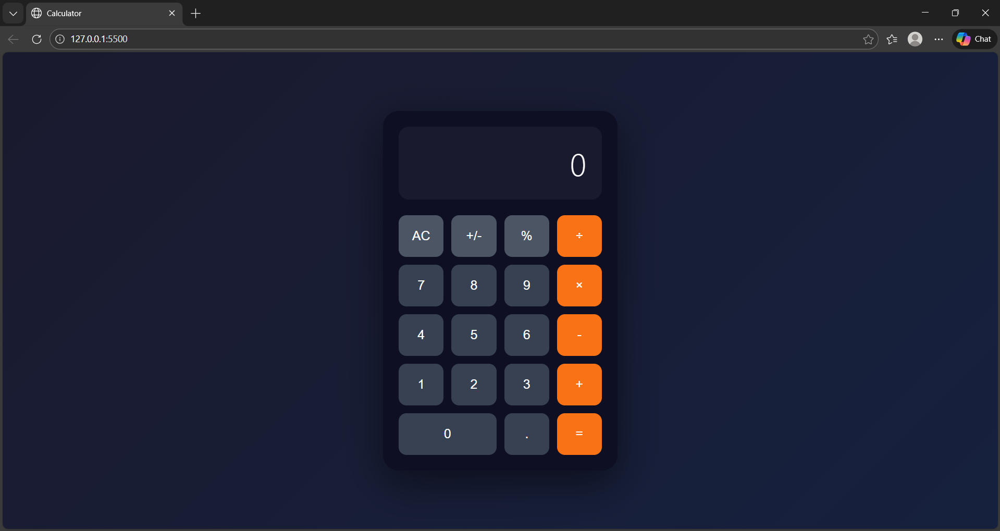

# 🧮 Modern Calculator

A clean, modern, and responsive calculator built using **HTML, CSS, and JavaScript**.  
It supports basic arithmetic operations with a smooth UI inspired by modern design trends.

---

## 📸 Preview

> Replace `screenshot.png` with your actual image name (example: `calculator.png`).  
> Make sure the image is placed in the same folder as `README.md`.

---

## 🚀 Features

- Responsive UI with modern layout  
- Smooth button interactions  
- Supports:
  - Addition (+)
  - Subtraction (-)
  - Multiplication (×)
  - Division (÷)
  - Percentage (%)
  - Decimal inputs
  - Plus/Minus toggle  
- Completely built using vanilla HTML, CSS, and JavaScript  
- Clean and modular folder structure

---

## 📂 Project Structure

📁 Calculator-Project
│── index.html
│── style.css
│── script.js
│── README.md
│── screenshot.png

---

## 🛠️ How to Run

1. Download the project
2. Place all files in the same folder
3. Open **index.html** in any browser  
   OR  
   Use **VS Code → Live Server** for hot reload.

---

## ❤️ Author

Made with love by **Vaishnavi Shahane** ✨  

If you improve or redesign it, feel free to share!

